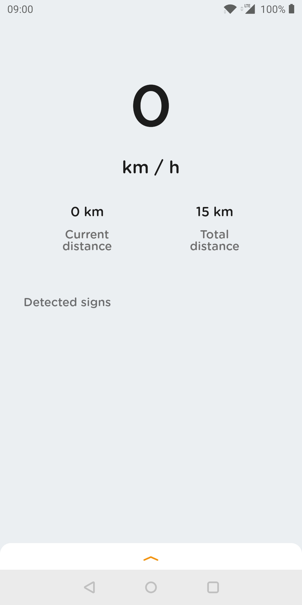
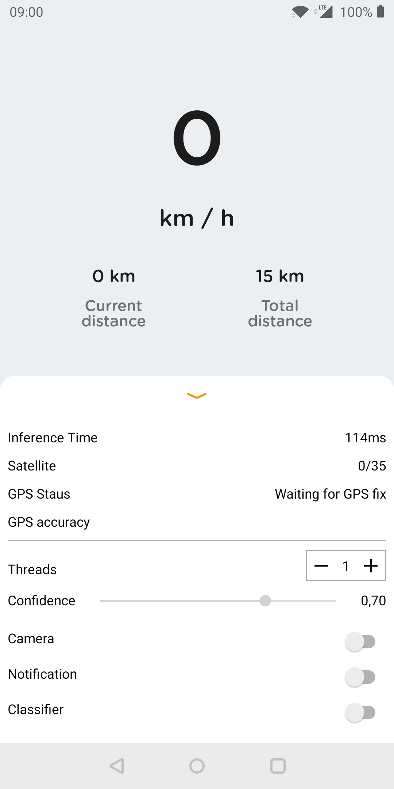

# RoadEye v2.0

A state-of-the-art Android application that uses Real-Time Computer Vision and Deep Learning to detect, classify, and alert drivers about traffic signs on the road. Built with safety and driver assistance in mind.

## What's New in v2.0

- **Brand New App Icon** - Custom-designed traffic sign launcher icon with red ring and camera lens motif
- **Speed Limit Comparison** - Dashboard shows detected speed limits in real-time and compares with current speed (green = safe, red = exceeding)
- **Trip Timer** - Live session duration tracker on the dashboard
- **Haptic Feedback** - Vibrates on every new sign detection (can be toggled in settings)
- **Theme Toggle** - Switch between Light, Dark, and System theme modes in-app
- **Voice Volume Control** - Adjustable voice notification volume slider
- **Enhanced Statistics** - View session stats including total signs found, max speed, and last detected limit
- **Empty State** - Clean "No signs detected yet" message when history is empty
- **Rewritten Sign Matching** - Faster switch-based sign lookup instead of if-else chains

## Features

- **Real-time Traffic Sign Detection:** Employs TensorFlow Lite (SSD MobileNet) to identify traffic signs directly from the camera feed.
- **Speed Limit Classification & Comparison:** Detects speed limit signs and compares with current vehicle speed, showing visual green/red status.
- **Intelligent Speed Alerts:** Audio and visual warnings when the vehicle exceeds 50 km/h or the detected speed limit.
- **GPS Dashboard:** Real-time display of current speed (large format), distance traveled, trip timer, GPS satellite count, and location accuracy.
- **Sign History Log:** Card-based history of detected signs with timestamps, confidence scores, and location data.
- **Session Statistics:** Tracks total signs detected, max speed, and session duration.
- **Haptic Feedback:** Subtle vibration on new sign detection for immediate awareness.
- **Interactive UI:** Modern Material 3 card-based design with camera overlay for bounding boxes, persistent bottom sheet for settings, and adaptive theming.
- **Theme Modes:** Switch between Light, Dark, or System-following theme at runtime.
- **Volume Control:** Adjust voice notification volume independently of device media volume.
- **About Page:** Detailed app information with developer credits (Developer: akapatil, Version 2.0.0).
- **Clear History:** One-tap option to clear detected sign history.
- **Advanced Configuration:** Adjustable detection confidence thresholds (0-100%), configurable thread count (1-9), toggleable voice notifications, haptic feedback, and camera preview.

## Tech Stack

- **Language:** Java
- **Machine Learning:** TensorFlow Lite (SSD MobileNet for detection, custom CNN for speed limit classification)
- **Dependency Injection:** Dagger 2
- **Reactive Programming:** RxJava 2 & RxAndroid
- **Image Loading:** Glide
- **JSON Handling:** Gson
- **UI Framework:** Material Components 3 (Material 3 / Material You)
- **Architecture:** Single-Activity with Camera2 API, fragment-based camera management
- **Build System:** Gradle with Android Gradle Plugin 8.7.1

## Supported Traffic Signs

The system detects and identifies 21 sign types:
- **Speed Limits:** 5, 10, 20, 30, 40, 50, 60, 70, 80, 90, 100 km/h
- **Mandatory & Prohibitory:** Stop, Give Way, No Entry, No Parking, No Overtaking, Don't Stop, Don't Move
- **Warning:** Crosswalk, Children
- **Informational:** Main Road

## Project Structure

```
├── AndroidManifest.xml              # App manifest with permissions and activities
├── build.gradle                     # Root build configuration
├── proguard-rules.pro               # ProGuard rules
├── java/com/carassistant/
│   ├── application/                 # Application class (Dagger init)
│   ├── di/                          # Dagger modules and components
│   ├── managers/                    # SharedPreferences persistence
│   ├── model/                       # Data entities, event bus
│   │   ├── bus/                     # RxJava-based event bus
│   │   └── entity/                  # SignEntity, Data, GpsStatusEntity
│   ├── tflite/                      # TensorFlow Lite models
│   │   ├── detection/               # SSD MobileNet detection
│   │   ├── classification/          # Speed limit classifier
│   │   └── tracking/                # MultiBoxTracker for bounding boxes
│   ├── ui/
│   │   ├── activities/             # DetectorActivity, CameraActivity, AboutActivity
│   │   ├── adapter/                 # SignAdapter for RecyclerView
│   │   └── fragments/              # Camera2 and Legacy camera fragments
│   └── utils/                       # Image processing, custom views, audio
├── assets/                          # TFLite models, label maps, model info
└── res/                             # Layouts, drawables, fonts, audio, values
    ├── layout/                      # Main layouts (portrait)
    ├── layout-land/                 # Landscape layouts
    ├── drawable/                    # Icons, shapes, sign images
    ├── menu/                        # Toolbar menu
    ├── values/                      # Colors, strings, themes, dimensions
    └── raw/                         # Voice notification audio files
```

## Getting Started

### Prerequisites
- Android Studio Koala (or higher)
- Android SDK 24 (Nougat / Android 7.0) or higher
- A physical Android device with a camera and GPS support

### Installation
1. Clone the repository:
   ```bash
   git clone https://github.com/Veershah696/RoadEye.git
   ```
2. Open the project folder in **Android Studio**.
3. Allow Gradle to sync and download dependencies.
4. Deploy the application to your connected Android device.

### Build Commands
```bash
# Windows
gradlew.bat assembleDebug

# Unix/macOS
./gradlew assembleDebug
```

## Permissions Required
- **Camera:** For real-time video preview and sign detection
- **Location (GPS):** For speed tracking, distance measurement, and location tagging of detected signs

## Developer

- **Developer:** akapatil
- **Version:** 2.0.0

## Screenshots

| Dashboard | Detection | Settings |
|---|---|---|
|  |  |  |

## License

All Rights Reserved. See [LICENSE](LICENSE) file for details. No use permitted without explicit written permission from the developer.
